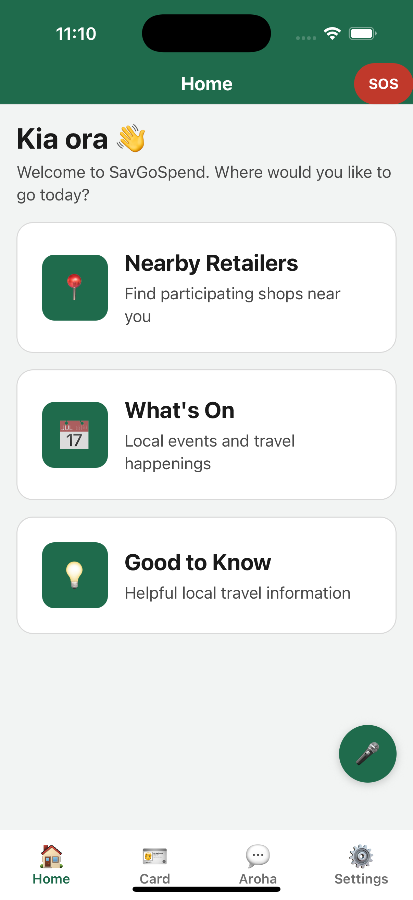

# SavGoSpend (SGO)

A dignity-first smart rewards mobile app for independent New Zealand travellers aged 65+.
Built with React Native (Expo) for iOS and Android.

Early scaffold: the app boots, onboards a member, navigates, and renders the core
screens. Firebase, Google Maps, and remaining features are wired in incrementally.

## Demo

Click the image for a short walkthrough of the project's functionality.

[](https://www.youtube.com/watch?v=8TBIuEFlCmI)

## Tech stack

- **Expo SDK 56** + **React Native 0.85** + **React 19**, file-based routing (`expo-router`)
- **Firebase** — anonymous auth + Firestore (env-driven, optional)
- **react-native-maps** (native only) + **expo-location** — nearby retailers
- **AsyncStorage** — offline-first local cache

## Getting started

```bash
npm install
cp .env.example .env    # then fill in Firebase keys (optional)
npm start               # press i / a / w for iOS / Android / web
```

- `npm run ios` / `android` / `web`
- `npm run typecheck` — strict TypeScript, no emit

### Configuration

- **Firebase** (optional): set `EXPO_PUBLIC_FIREBASE_*` in `.env` (see `.env.example`).
  These web keys aren't secrets — `firestore.rules` governs access. Enable **Anonymous**
  sign-in in the Console and deploy rules with `firebase deploy --only firestore:rules`.
  With no `.env`, the app runs local-only.
- **Maps**: iOS uses **Apple Maps** (no key); **Android** needs a Google Maps key —
  replace `REPLACE_WITH_ANDROID_GOOGLE_MAPS_API_KEY` in `app.json`. For Google Maps on
  iOS, add a real `ios.config.googleMapsApiKey` (a placeholder breaks `pod install`).
  Maps render on native builds only; web shows a fallback.

## Project layout

```
app/                  # expo-router routes
  _layout.tsx         # root stack, guards onboarding vs. tabs, SOS in header
  (onboarding)/       # welcome → about-you → preferences → all-set
  (tabs)/             # Home, Card, Aroha, Settings
  rewards.tsx         # Smart Rewards: balance, tiers, redeem, activity
  retailers.tsx       # Nearby Retailers (map + distance-sorted list, check-in, directions)
  whats-on.tsx        # upcoming events
  good-to-know.tsx    # articles
src/
  theme/              # colours, typography, a11y-aware ThemeProvider
  components/         # AppText, Screen, Tile, buttons, form controls, Barcode
  hooks/              # useNearbyLocation (consent-gated expo-location)
  providers/          # MemberProvider (offline-first member state)
  lib/                # firebase init, authSession, firestore, rewards, geo, events
  constants/          # Aroha copy, sample seed data
  types/              # domain models
```

## Accessibility

A first-class requirement: all text flows through `<AppText>` (honours **Larger Text**
and **High Contrast**), touch targets are ≥56px, colour pairs target WCAG 2.1 AA, and
interactive elements carry roles, labels, and hints.

## Data & sync

The Firebase JS SDK has no Firestore offline persistence on React Native, so the app is
**offline-first**: **AsyncStorage** (`sgo.member.v1`) is the source of truth the UI reads;
**Firestore** (`members/{uid}`) is an optional cloud mirror. `MemberProvider` loads the
cache on boot, then attaches an `onSnapshot` listener (keyed by anonymous-auth uid) that
refines it when online. Mutations update the cache immediately, then sync best-effort.
`firestore.rules` enforces per-member isolation; Settings shows "☁️ Synced" or "📱 Stored
on this device".

## Smart Rewards

`src/lib/rewards.ts` holds the pure tier logic — five tiers (Explorer → Wayfarer →
Voyager → Pathfinder → Kaumatua). Members earn points by checking in at a retailer (once
per day each) and **redeem** them against a catalogue on the Rewards screen.

Members have two balances: **spendable** `points` (what redeeming draws down) and
**lifetime** `lifetimePoints` (total ever earned, which drives the tier). Lifetime points
never decrease, so spending never demotes a member — a deliberate, dignity-first choice
(a Kaumatua stays a Kaumatua). Tier thresholds and the sample catalogue are placeholders.

## Voice Commands

An accessibility opt-in (Settings → "Voice Commands") that lets members navigate by
speaking — built for those who find tapping small targets hard. Tap the mic, speak ("open
my card", "nearby retailers", "how many points do I have", "emergency", "what can I say"),
and the app navigates, answers, and speaks a confirmation back.

**Requires a dev build.** `expo-speech-recognition` ships native code that **does not run
in Expo Go**. Build a dev client and rebuild whenever the package or its plugin changes:

```bash
npx expo prebuild
npx expo run:ios        # or: npx expo run:android
```

Architecture:

- `src/lib/voiceCommands.ts` — pure, testable core: command vocabulary plus whole-word,
  longest-match parsing of a transcript to an intent (navigate / emergency / help).
- `src/providers/VoiceProvider.tsx` — the runtime (state, command execution, `expo-speech`
  TTS in `en-NZ`). Never imports `expo-speech-recognition` directly.
- `src/providers/VoiceRecognitionBridge.tsx` — all `expo-speech-recognition` imports live
  here, behind a `React.lazy` boundary mounted only when the native module is present and
  the member has opted in.
- `src/components/VoiceButton.tsx` — app-wide mic control + status pill, shown once a
  member opts in.

**Graceful degradation:** `src/lib/speechRecognition.ts` probes with
`requireOptionalNativeModule` (no import, no throw). Where recognition is unavailable
(Expo Go, web), the app runs normally — the mic button hides and the toggle disables itself.

## TODO

- Not yet built: retailer profiles, community "Post a Tip" + review queue, moving
  catalogue data into Firestore, SGO admin panel, animated map markers.
